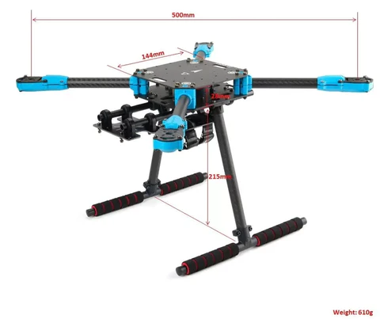

# Equipment

**Jussi Kalliola, Lauri Suomela, Sasanka Kuruppuarachichi, Joni Kämäräinen**

*Computer vision group, Tampere University, Finland*

## Citing

If you use 3D models, or otherwise take inspiration from those or the documentation, please consider citing the work:

```
@misc{tuni2024robots,
  author       = {Kalliola, Jussi and Kuruppuarachichi, Sasanka and Suomela, Lauri},
  title        = {Robotics documentation - Tampere University},
  publisher    = {Github},
  year         = {2024},
  howpublished = {https://github.com/JussiKalliola/HolybroX500-docs}
}
```

## Overview

Robotics related equipment, tutorials, tips&tricks, 3D models and so on are listed here. Robot specific information can be found in their own directories. If new equipment is added, please duplicate the `/example-dir` and try to use the same structure. Template for the documentation is provided in the folder. Then update the equipment catalog below with the new equipment, and provide short description about the capabilities(sensors/computers/other gadgets) and use cases (indoor/outdoor/ground/air/...).

If possible, provide guides how to get started and how to use, **and all the required safety measures**. This can be a place to provide tips&tricks and tutorials for tricky stuff which caused pain and suffering, so that others dont need to feel the same pain again *(or that you remember how to do it again...)*


## Drones


| Name | Use case | Capabilities | Main user | More |
| ----- | ----- | ------ | -------- | ------- | 
| [Holybro X500 v2]((holybro-x500-v2/README.md)) | Outdoor | RTK GPS, multi GPS, Companion computer, depth camera, Lidar | [Jussi Kalliola](https://github.com/JussiKalliola) | |


