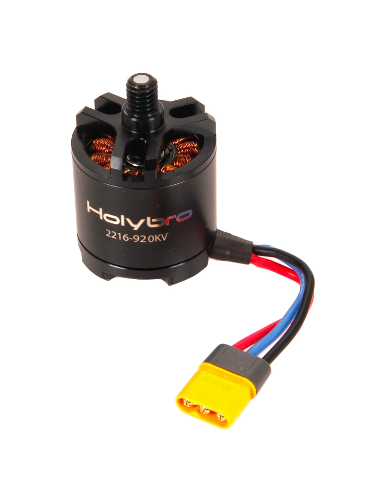
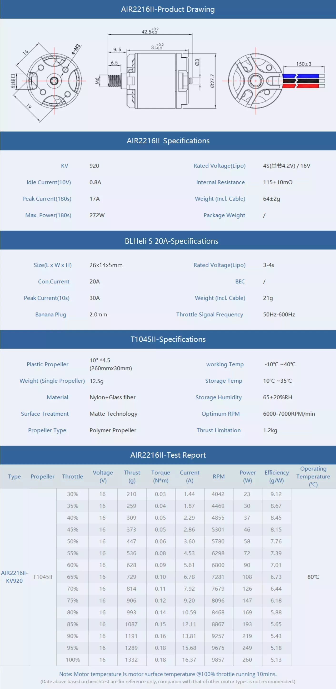
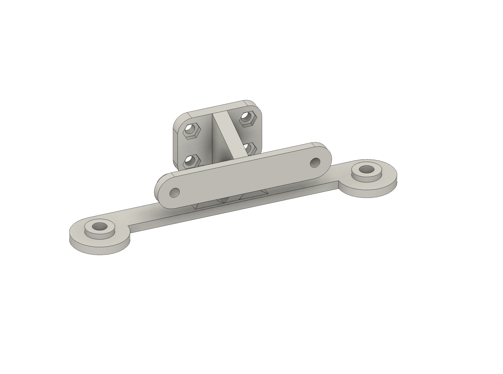

# Example docs

<p style="text-align: justify;">This user manual contains information about the components, software, firmware, custom-made parts (e.g., 3D printed), and custom software features. The drone is mainly used for computer vision, edge computing, and aerial robotics research in computer vision and software engineering research groups at the Tampere University.

The main focus of the documentation is to provide sufficient instructions on how to assembly, disassembly, add, modify or remove hardware components (e.g., sensors, companion computers), user instructions, and repair or service the device. 


## Current setup

In this section, current setup (hardware, software, and firmware) is described. <strong>Please update the information in this section if drone is modified or software/firmware is updated so that the modifications can be tracked.</strong>

<Strong>Hardware</strong>
- HW1 
- HW2
- ...

<strong>Software & Firmware</strong>
- Software1 version Xx.xx
- Software2 version XX.xx


## User instructions

<p style="text-align:justify;">How to operate drone, start, turn off, use software etc. What are the special stuff what needs to be taken care off, MTOW, limitations, etc. Service and repair instructions</p>

<details>
<summary><strong>Assembly guide</strong></summary>

Written/image guide how to put the drone together.

[Example Link1](https://youtu.be/27rbxCeCq4Y) | [Example link 2](https://holybro.com/collections/x500-kits/products/px4-development-kit-x500-v2)

</details>

<details>
<summary><strong>Getting started</strong></summary>

---

In this section write about how to turn on, off, take off, land, switch modes from controller, pair everything, what to check before each flight etc. Write after assembly and first flight.


---

</details>


<details>
<summary><strong>Restrictions, limitations, and safety</strong></summary>

---

### Weather

Write about weather restrictions

### MTOW, payload, and other limitations/things to consider


### Batteries etc.


---

</details>

<details>
<summary><strong>Service and repair</strong></summary>

#### Checklist before usage

List of things what should be checked everytime before using the device
- e.g., Clean lens with microfiber cloth
- e.g., Attach propellers, battery/fuel source, and insert SD card / lens filters

#### Service checklist after usage

Like all things with moving parts and electronics, regular or constant use causes wear and tear. For drones, it’s advisable to implement a routine maintenance programme on a per-flight basis rather than set dates in the calendar.

- e.g., Take care of the essentials and clean dirt and from the chassis. 
- e.g., Use an anti static cloth, a compressed air cleaner and a light brush to keep the UAV in a shiny, out-of-the-box condition.

#### Repair

How to repair and what to repair

#### Schedule

Repair/service schedule description

</details>


## Hardware & Software

Short description about the hardware and software. E.g., mention if the robot is custom built or development kit/consumer product and what kind of software is required. Short list of features and specs.

<strong>Features and specification:</strong>
- ...


<h4><strong>Dimensions</strong></h4>

Provide dimensions as image/written.

More information: Links to additional information. 


<details>
<summary><strong>Detailed list of hardware and software</strong></summary>


Here provide a detailed list of hardware and software used. Provide at least the following information about hardware:
- Name
- specs
- Link where it was bought or where to find more information
- image (optional)

Example:


<details>
<summary><strong>4x holybro 2216 KV920 motors</strong></summary>



#### <strong>Motor specification</strong>




</details>

<details>
<summary> <strong>4x BLHeli S ESC 20A</strong></summary>


<strong>Specification:</strong>
- Continuos current: 20A
- Burst Current (10S): 30A
- BEC: No
- LiPo cells: 2-4S
- Maximum speed: 500k eRPM

More information: [MyBotShop](https://www.mybotshop.de/Holybro-X500-V2-BLHeli-S-20A-ESC_1)
</details>


---

### Additional components

Please provide a list of additional components/gadgets which can be used with the robot.

Example: 


<details>
<summary><strong>Holybro H-RTK F9P Rover Lite</strong></summary>


<strong>Specification:</strong>
- Rover (aircraft) only
- GPS/GLONASS/BeiDou/Galileo
- Data and update rate 20Hz RAW
- Working voltage 4.75~5.25V
- Current consumption ~250mA
- Weight 106g

More information: [Holybro store](https://holybro.com/collections/standard-h-rtk-series/products/h-rtk-f9p-gnss-series) | [Documentation](https://docs.holybro.com/gps-and-rtk-system/f9p-h-rtk-series/standard-f9p/overview) | [H-RTK with Cube Autopilot](https://docs.holybro.com/gps-and-rtk-system/f9p-h-rtk-series/standard-f9p/h-rtk-with-cube-autopilot) | [Setup and getting started](https://docs.holybro.com/gps-and-rtk-system/f9p-h-rtk-series/standard-f9p/setup-and-getting-started)

#### <strong>Dimensions</strong>


#### <strong>Pinmap</strong>


</details>


---

### Software

List of software required to use the robot. Mention if the software is custom-made and provide a link (if open access) where to access it and how to use it. If its not custom-made, then short description about the software, features and links where more information can be found.

Example: 


<details>
<summary><strong>PX4 Flight Stack</strong></summary>

PX4 autopilot is an open-source autopilot system oriented toward inexpensive autonomous aircraft. PX4 is capable of integrating with other autopilot software, such as the QGroundControl ground control station software, via the MAVLink (Micro Air Vehicle Communication) protocol.

<Strong>Supported features</strong>
- Support for multiple vehicle types, including fixed-wing aircraft, multicopters, helicopters, rovers, boats, and underwater vehicles
- Fully manual, partially assisted, and fully autonomous flight modes
- Vehicle stabilization
- Waypoint navigation
- Integration with position, speed, altitude, and rotation sensors
- Automatic triggering of cameras or external actuators

More information: [Documentation](https://docs.px4.io/main/en/) | [Wikipedia](https://en.wikipedia.org/wiki/PX4_autopilot) | [Youtube](https://www.youtube.com/channel/UCkrtSvera-xusjMtgMUe-HA) | [Github](https://github.com/PX4/PX4-Autopilot)

#### <strong>Flight controller architecture</strong>

The diagram below provides a high level overview of a typical "simple" PX4 system based around a flight controller.

The hardware consists of
- Flight controller (running the PX4 flight stack). This often includes internal IMUs, compass and barometer.
- Motor ESCs connected to PWM outputs, DroneCAN (DroneCAN allows two-way communication, not single direction as shown) or some other bus.
- Sensors (GPS, compass, distance sensors, barometers, optical flow, barometers, ADSB transponders, etc.) connected via I2C, SPI, CAN, UART etc.
- Camera or other payload. Cameras can be connected to PWM outputs or via MAVLink.
- Telemetry radios for connecting to a ground station computer/software.
- RC Control System for manual control

The left hand side of the diagram shows the software stack, which is horizontally aligned (approximately) with the hardware parts of the diagram.


#### <strong>High-level Software Architecture</strong>

The diagram below provides a detailed overview of the building blocks of PX4. The top part of the diagram contains middleware blocks, while the lower section shows the components of the flight stack. The arrows show the information flow for the most important connections between the modules. In reality, there are many more connections than shown, and some data (e.g. for parameters) is accessed by most of the modules.

Modules communicate with each other through a publish-subscribe message bus named uORB.


</details>


---


## 3D prints

CAD models for different 3D printable parts (computer and camera mounts, propeller guard etc.) can be found from `/cad` directory.  

Example:

<details>
<summary><strong>Camera mounts</strong></summary>


| Cameras    | CAD model | Image |
| -------- | ------- | ------ |
| RealSense D455 + T265  | [../holybro-x500-v2/cad/D455mount/d455_t265_mount_f](../holybro-x500-v2/cad/D455mount/d455_t265_mount_f.ipt)|  |

</details>


</details>

## Citing

If you use 3D models, or otherwise take inspiration from those or the documentation, please consider citing the work:

```
@misc{kalliola2024dronedocs,
  author       = {Kalliola, Jussi and Kuruppuarachichi, Sasanka and Suomela, Lauri},
  title        = {Holybro x500 v2 Drone docs - Tampere University},
  publisher    = {Github},
  year         = {2024},
  howpublished = {https://github.com/JussiKalliola/HolybroX500-docs}
}
```


